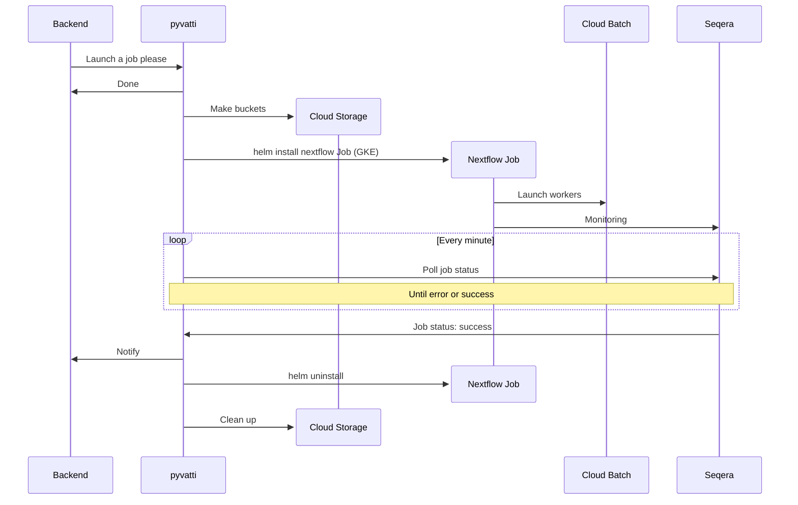

# hattivatti

`hattivatti` is a job submission service for the INTERVENE platform. For each requested job instance it configures compute resources to:

* transfer and decrypt on the fly data to a secure area (i.e. a bucket)
* calculate polygenic scores using the PGS Catalog Calculator
* upload results to a different secure area (i.e. a different bucket)
* monitor and notify the backend about job status

The main component is `pyvatti`, a FastAPI application that sets up a standard API for the job submission service to deploy across different environments (cloud or HPC). 

`pyvatti` should be deployed on a Kubernetes cluster, and a Helm chart is available to simplify deployment.

PGS Catalog Calculator jobs are installed to the local Kubernetes cluster as Job objects, but compute happens externally (Cloud Batch / SLURM).

## Configuration and deployment

Configuring the FastAPI application requires some environment variables to be set. See [pyvatti/src/pyvatti/config.py](https://github.com/ebi-gdp/hattivatti/blob/main/pyvatti/src/pyvatti/config.py) for a description.

Set these variables in the helm values file [chart/values-example.yaml](https://github.com/ebi-gdp/hattivatti/blob/main/chart/values-example.yaml).

And run:

```
$ helm install hattivatti . -n <namespace> -f <path_to_values.yaml>
```

## Deploying jobs with Google Cloud Platform



The basic idea is that the python application:

* builds a helm values file from the API call
* creates compute resources, including:
  * buckets for doing work
  * installing a job to the local Kubernetes cluster (`helmvatti`) using the helm CLI
* monitors and manages the resources for the lifetime of the job 

